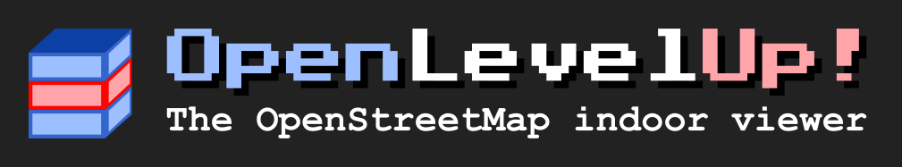

OpenLevelUp!
============



Read-me
-------

OpenLevelUp! is a web viewer for indoor data from the [OpenStreetMap](http://openstreetmap.org) project.
It allows you to see inside buildings, level by level through your web browser. This is written in JavaScript.
The data is retrieved from OpenStreetMap using [Overpass API](http://wiki.openstreetmap.org/wiki/Overpass_API).
For more details about the project, how to contribute on indoor in OpenStreetMap, and some use cases, see [OpenLevelUp on OSM wiki](https://wiki.openstreetmap.org/wiki/OpenLevelUp).

A live demo is available at [openlevelup.net](http://openlevelup.net/). For development version (maybe unstable), see [dev.openlevelup.net](http://dev.openlevelup.net/).

[](https://liberapay.com/PanierAvide/donate)


Examples of well-mapped areas
-----------------------------

* [Shopping mall #1](http://openlevelup.net/?lat=48.136858&lon=-1.695054&z=18&t=0&lvl=0&tcd=1&urd=0&bdg=0&pic=0&nte=0)
* [Shopping mall #2](http://openlevelup.net/?lat=44.121009&lon=4.839004&z=19&t=0&lvl=0&tcd=1&urd=0&bdg=0&pic=0&nte=0)
* [Subway station](http://openlevelup.net/?s=m.39i+-1.IVI+U6+-1.0+0)
* [Railway station](http://openlevelup.net/?s=m.LZm+2.9oO+T6+-2.0+0)
* [University campus](http://openlevelup.net/?lat=49.010961&lon=8.414637&z=17&t=0)


Build
-----

### Dependencies
* npm
* inkscape (for converting SVGs to PNGs)
* sed

### Compiling

If you want to build OpenLevelUp! by yourself, you can do the following (but it's not necessary for install, as a build is already available in **dist.zip**):
```
npm install
make
```
When this is done, OpenLevelUp! is ready in **dist/** folder.


Installation
------------

If you want to install your own OpenLevelUp! instance, just upload the content of the **dist/** folder after build (or of **dist.zip**) in your own FTP or web server. That's all.


Using
-----

Integrating OpenLevelUp in your own website is easy, just do in your HTML page:
```
<head>
...
	<!-- CSS import -->
	<link rel="stylesheet" href="OLU.min.css" />
	<style>
		#openlevelup {
			width: 100%;
			height: 500px;
		}
	</style>
...
</head>
<body>
	<!-- Container div -->
	<div id="openlevelup"></div>
	
	<!-- JS import -->
	<script src="OLU.js"></script>
	<!--script src="OLU.min.js"></script-->
	
	<!-- Init code -->
	<script>
		var myOlu = OLU.init(
			"openlevelup",		//The div ID
			"basic",			//The mode, between "basic" and "advanced"
			{}					//The configuration, optional
		);
	</script>
</body>

```

### Configuration


Contribute
----------

If you speak both english and another language, you may be interested in OpenLevelUp translation. See **lang.json**,
which contains all labels used in the interface and their translations.


License
-------

Copyright 2015-2016 Adrien PAVIE

See LICENSE for complete AGPL3 license.

OpenLevelUp! is free software: you can redistribute it and/or modify
it under the terms of the GNU Affero General Public License as published by
the Free Software Foundation, either version 3 of the License, or
(at your option) any later version.

OpenLevelUp! is distributed in the hope that it will be useful,
but WITHOUT ANY WARRANTY; without even the implied warranty of
MERCHANTABILITY or FITNESS FOR A PARTICULAR PURPOSE.  See the
GNU Affero General Public License for more details.

You should have received a copy of the GNU Affero General Public License
along with OpenLevelUp!. If not, see <http://www.gnu.org/licenses/>.
